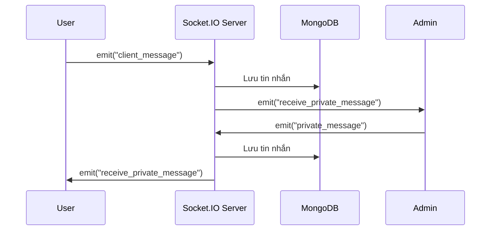
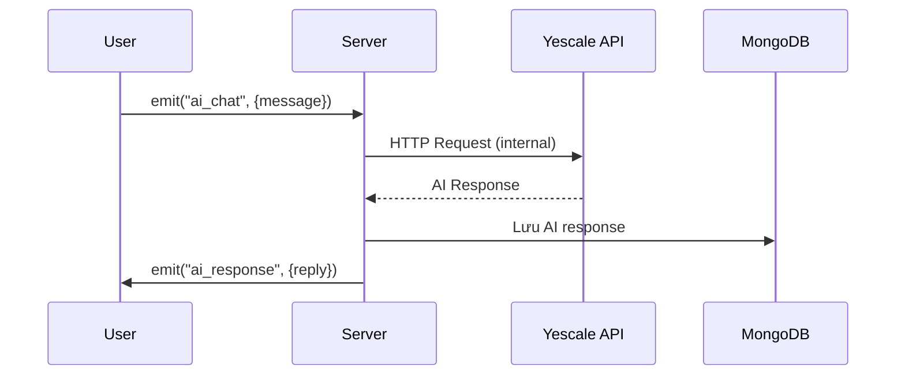

# Hệ Thống Chat Thời Gian Thực - Pure Socket.IO

## Tổng Quan Dự Án

Hệ thống chat thời gian thực được xây dựng **100% bằng Socket.IO (Pure WebSocket)**, cho phép giao tiếp 2 chiều giữa khách hàng và admin với AI tự động hỗ trợ.

## Công Nghệ Sử Dụng

### Frontend
- **React** - Thư viện UI
- **Socket.IO Client** - Giao tiếp real-time
- **Vite** - Build tool

### Backend
- **Node.js + Express** - Server framework (chỉ để serve static files)
- **Socket.IO** - **100% Communication qua WebSocket**
- **MongoDB + Mongoose** - Database
- **OpenAI SDK** - AI chatbot (Yescale API)

### Kiến Trúc
- **Pure Socket.IO** - Không có REST API endpoints
- **Event-Driven Architecture** - Toàn bộ logic qua socket events
- **Real-time Bidirectional** - WebSocket persistent connection

## Tính Năng Chính

### 1. Chat Thời Gian Thực (Pure WebSocket)
- Kết nối 2 chiều User ↔ Admin
- Tất cả giao tiếp qua socket events (không fetch API)
- Lưu lịch sử vĩnh viễn

### 2. AI Chatbot Tự Động
- Tự động phản hồi mọi tin nhắn từ User
- Trigger: từ khóa "tư vấn", "iphone", "giá"
- Giao tiếp AI hoàn toàn qua socket event

### 3. Quản Lý Người Dùng
- Theo dõi online/offline real-time
- Admin xem danh sách User
- Private chat 1-1

### 4. File Upload (Binary over WebSocket)
- Upload file qua socket event
- Không dùng HTTP multipart

## Socket Events Map

### Client → Server
```javascript
"login"              // Đăng nhập
"get_chat_history"   // Lấy lịch sử chat
"ai_chat"            // Gửi câu hỏi cho AI
"private_message"    // Admin gửi tin nhắn riêng
"client_message"     // User gửi tin nhắn
"upload_file"        // Upload file
"disconnect"         // Ngắt kết nối
```

### Server → Client
```javascript
"chat_history"           // Trả lịch sử chat
"ai_response"            // Phản hồi từ AI
"receive_private_message" // Nhận tin nhắn riêng
"update_user_list"       // Cập nhật danh sách user
"user_connected"         // Thông báo user mới
"user_disconnected"      // Thông báo user offline
"file_uploaded"          // File đã upload
"error"                  // Thông báo lỗi
```

## Luồng Hoạt Động

### Chat User → Admin (Pure Socket)



### AI Auto-Reply (Pure Socket)



## Cấu Trúc Thư Mục

```
iphone-main/
├── backend/
│   ├── models/
│   │   └── Message.js       # Schema tin nhắn
│   ├── uploads/             # File uploads
│   └── server.js            # Pure Socket.IO server
│
└── iphone-main/             # Frontend
    └── src/
        └── components/
            ├── ChatWindow.jsx
            ├── ChatPage.jsx
            └── ChatSidebar.jsx
```

## Điểm Khác Biệt với REST API

| Tiêu chí | REST API | Pure Socket.IO |
|----------|----------|----------------|
| **Communication** | HTTP Request/Response | WebSocket Events |
| **Connection** | Stateless, mở lại liên tục | Persistent, 1 connection |
| **Real-time** | Phải polling | Native real-time |
| **Endpoints** | `/api/chat/history` | `emit("get_chat_history")` |
| **Data format** | JSON via fetch() | Events via socket.emit() |
| **Overhead** | HTTP headers mỗi request | Minimal frame overhead |

## Ưu Điểm Pure Socket.IO

1. **True Real-time** - Không cần polling
2. **Low Latency** - Persistent connection
3. **Bidirectional** - Server có thể push bất kỳ lúc nào
4. **Simple Architecture** - Không cần REST routes/controllers
5. **Event-driven** - Clean code pattern

## Use Cases

1. Khách hỏi "tư vấn iPhone 15" → AI tự động phản hồi qua socket
2. Admin reply trực tiếp → User nhận ngay lập tức
3. Upload hình ảnh sản phẩm → Binary data qua WebSocket
