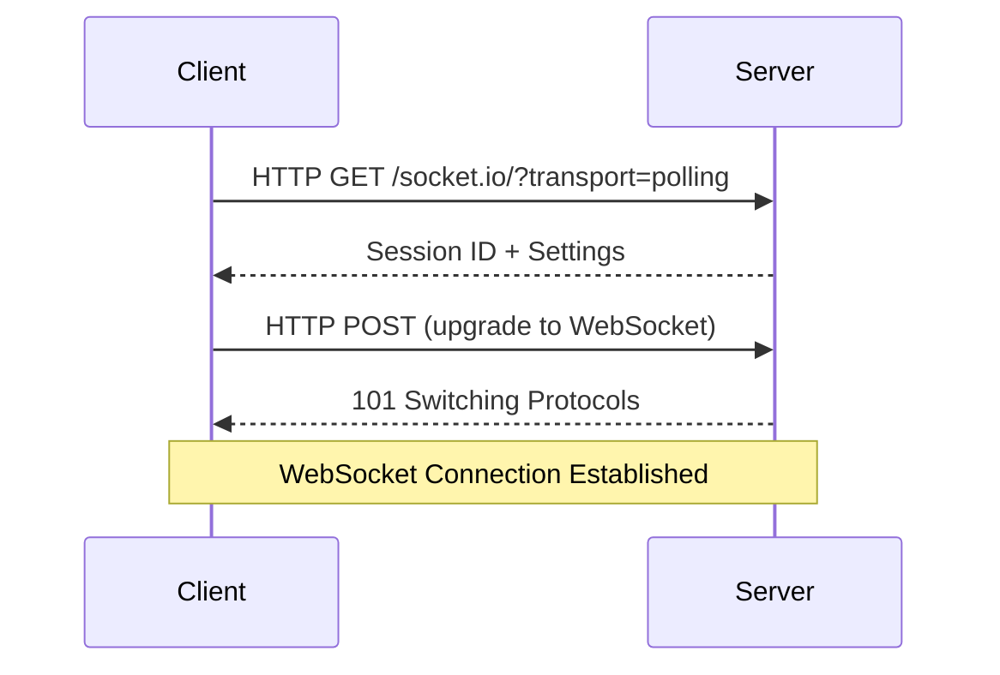

# Socket.IO - Kiến Thức Chuyên Sâu

## WebSocket vs HTTP

### HTTP - Traditional Request/Response
```
Client                  Server
   |----Request---->|
   |                |
   |<---Response----|
   |                |
Connection Closed
```

**Đặc điểm:**
- Stateless (không lưu trạng thái)
- Mỗi request mở 1 connection mới
- Client phải chủ động hỏi server

### WebSocket - Persistent Connection
```
Client                  Server
   |----Handshake---->|
   |<---Handshake-----|
   |                  |
   |<====Data========>|
   |<====Data========>|
   |                  |
Connection Remains Open
```

**Đặc điểm:**
- Stateful (giữ kết nối)
- Full-duplex (2 chiều đồng thời)
- Server có thể push data

---

## Socket.IO Architecture

### 1. Handshake Process



**Bước 1:** Polling
- Client gửi HTTP request
- Server trả về session ID

**Bước 2:** Upgrade
- Nâng cấp lên WebSocket protocol
- Thiết lập persistent connection

---

### 2. Events System

Socket.IO hoạt động dựa trên **Event-Driven Architecture**

```javascript
// Server
io.on('connection', (socket) => {
  socket.on('custom_event', (data) => {
    // Handle event
  });
});

// Client
socket.emit('custom_event', { data: 'hello' });
```

**Event Flow:**
```
emit() -> Network -> on() listener triggered
```

---

### 3. Rooms và Namespaces

#### Rooms (Phòng)
```javascript
// Join room
socket.join('room1');

// Emit to room
io.to('room1').emit('message', 'Hello room 1');

// Leave room
socket.leave('room1');
```

**Use case:**
- Chat rooms
- Game lobbies
- Private groups

#### Namespaces (Không gian tên)
```javascript
// Server
const chatNamespace = io.of('/chat');
const adminNamespace = io.of('/admin');

// Client
const chatSocket = io('http://localhost:5000/chat');
```

**Use case:**
- Tách biệt logic nghiệp vụ
- Multi-tenant applications

---

## Broadcasting Strategies

### 1. Broadcast to All
```javascript
io.emit('message', 'Hello everyone');
```
**Gửi đến:** Tất cả clients, kể cả sender

### 2. Broadcast Except Sender
```javascript
socket.broadcast.emit('message', 'Hello others');
```
**Gửi đến:** Tất cả clients, trừ người gửi

### 3. Emit to Specific Socket
```javascript
io.to(socketId).emit('message', 'Private message');
```
**Gửi đến:** 1 socket cụ thể

### 4. Emit to Room
```javascript
io.to('room1').emit('message', 'Hello room');
```
**Gửi đến:** Tất cả thành viên trong room

### 5. Emit to Multiple Rooms
```javascript
io.to('room1').to('room2').emit('message', 'Hello');
```

---

## Connection Management

### activeUsers Map
```javascript
const activeUsers = new Map();

// Add user
activeUsers.set(socket.id, { username: 'john', role: 'user' });

// Get user
const user = activeUsers.get(socket.id);

// Remove user
activeUsers.delete(socket.id);

// Iterate
activeUsers.forEach(([socketId, userData]) => {
  // Do something
});
```

**Tại sao dùng Map thay vì Object?**
- O(1) lookup performance
- Keys có thể là bất kỳ type nào
- Có methods tiện lợi (.size, .has(), .delete())

---

## Error Handling

### Connection Errors
```javascript
socket.on('connect_error', (error) => {
  console.error('Connection failed:', error);
});
```

### Event Errors
```javascript
socket.on('custom_event', (data) => {
  try {
    // Process data
  } catch (error) {
    socket.emit('error', { message: error.message });
  }
});
```

### Disconnect Handling
```javascript
socket.on('disconnect', (reason) => {
  if (reason === 'io server disconnect') {
    // Server đã kick client
  } else if (reason === 'transport close') {
    // Network issue
  }
});
```

---

## Performance Optimization

### 1. Acknowledgements
```javascript
// Client
socket.emit('message', data, (response) => {
  console.log('Server confirmed:', response);
});

// Server
socket.on('message', (data, callback) => {
  // Process
  callback({ status: 'received' });
});
```

**Benefit:** Đảm bảo message đã được nhận

### 2. Binary Data
```javascript
// Send Buffer instead of JSON
socket.emit('binary', Buffer.from([1, 2, 3]));
```

**Benefit:** Giảm bandwidth cho files/images

### 3. Compression
```javascript
const io = new Server(server, {
  perMessageDeflate: {
    threshold: 1024  // Compress nếu > 1KB
  }
});
```

---

## Security Best Practices

### 1. Validate Socket Data
```javascript
socket.on('message', (data) => {
  if (typeof data !== 'object' || !data.message) {
    return socket.emit('error', 'Invalid data');
  }
  // Process
});
```

### 2. Authentication
```javascript
io.use((socket, next) => {
  const token = socket.handshake.auth.token;
  if (isValidToken(token)) {
    next();
  } else {
    next(new Error('Authentication failed'));
  }
});
```

### 3. Rate Limiting
```javascript
const messageCount = new Map();

socket.on('message', (data) => {
  const count = messageCount.get(socket.id) || 0;
  
  if (count > 10) {
    return socket.emit('error', 'Rate limit exceeded');
  }
  
  messageCount.set(socket.id, count + 1);
  
  setTimeout(() => {
    messageCount.delete(socket.id);
  }, 60000);
});
```

---

## Debugging

### Enable Debug Logs
```javascript
// Client
localStorage.debug = 'socket.io-client:*';

// Server
DEBUG=socket.io:* node server.js
```

### Monitor Events
```javascript
socket.onAny((eventName, ...args) => {
  console.log(`Event: ${eventName}`, args);
});
```

### Track Connection State
```javascript
console.log(socket.connected);  // true/false
console.log(socket.id);         // Socket ID
```

---

## Advanced Patterns

### 1. Middleware Chain
```javascript
io.use(authMiddleware);
io.use(loggingMiddleware);
io.use(rateLimitMiddleware);
```

### 2. Event Acknowledgement
```javascript
socket.emit('request', data, (response) => {
  if (response.error) {
    // Handle error
  }
});
```

### 3. Volatile Events
```javascript
socket.volatile.emit('sensor_data', data);
```
**Không gửi lại nếu client offline** - Dùng cho real-time data không quan trọng

---

## Scalability

### Multiple Server Instances
Socket.IO có thể scale horizontally với Redis adapter:

```javascript
import { createAdapter } from '@socket.io/redis-adapter';
import { createClient } from 'redis';

const pubClient = createClient({ host: 'localhost', port: 6379 });
const subClient = pubClient.duplicate();

io.adapter(createAdapter(pubClient, subClient));
```

**Lợi ích:**
- Load balancing
- Sticky sessions không cần thiết
- Broadcast across processes

---

## Common Pitfalls

###  Gửi quá nhiều data
```javascript
// BAD
socket.emit('data', hugeObject);

// GOOD
socket.emit('data', { id: 123 });  // Gửi ID, client fetch riêng
```

###  Không cleanup listeners
```javascript
// BAD
useEffect(() => {
  socket.on('message', handler);
}); // Memory leak!

// GOOD
useEffect(() => {
  socket.on('message', handler);
  return () => socket.off('message', handler);
}, []);
```

###  Blocking event loop
```javascript
// BAD
socket.on('heavy_task', (data) => {
  // Synchronous heavy computation
  const result = heavyComputation(data);
});

// GOOD
socket.on('heavy_task', async (data) => {
  const result = await offloadToWorker(data);
});
```
