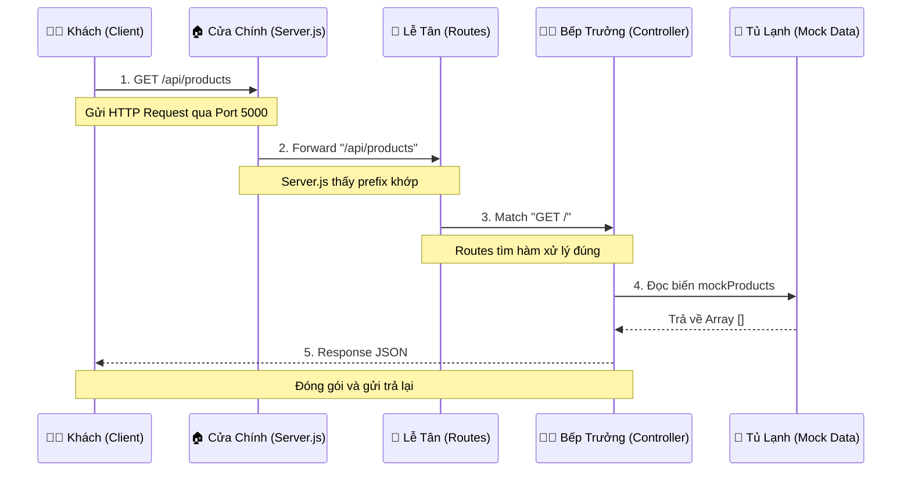

# 📚 GIẢI THÍCH CHI TIẾT CODE (CLIENT-SERVER VERSION)

Tài liệu này giải thích chi tiết hoạt động của hệ thống rút gọn, tập trung vào giao tiếp Client-Server.

## MỤC LỤC

1. [Cấu trúc Thư mục](#1-cấu-trúc-thư-mục)
2. [Server.js (Cổng kết nối)](#2-serverjs)
3. [Product Controller (Mock Data)](#3-product-controller)
4. [Product Routes (Điều hướng)](#4-product-routes)

---

## 1. Cấu trúc Thư mục

Backend chỉ giữ lại các file thiết yếu:

```
backend/
├── controllers/
│   └── product.controller.js  # Chứa dữ liệu giả (Mock Data) và logic trả về
├── routes/
│   └── product.routes.js      # Định nghĩa đường dẫn /api/products
├── middleware/
│   └── error.js               # Xử lý lỗi cơ bản
├── server.js                  # File chính, khởi tạo Server
└── package.json               # Khai báo thư viện (Express, Cors)
```

---

## 2. Server.js

File này đóng vai trò là "Tổng đài", lắng nghe yêu cầu từ Client.

```javascript
// 1. Import thư viện
import express from "express"; // Framework tạo Server
import cors from "cors";       // Cho phép Client (React) gọi vào

// 2. Khởi tạo App
const app = express();

// 3. Cấu hình CORS (Quan trọng cho Lập trình mạng)
// Cho phép mọi nguồn (*) truy cập để dễ test
app.use(cors({ origin: '*' }));

// 4. Định tuyến (Routing)
// Nếu Client gọi vào /api/products -> Chuyển sang productRoutes xử lý
app.use("/api/products", productRoutes);

// 5. Mở Cổng (Listen)
// Server ngồi đợi ở port 5000
app.listen(5000, () => {
    console.log("Server đang chạy tại port 5000");
});
```

---

## 3. Product Controller

Đây là nơi "Lưu trữ dữ liệu" (thay vì Database) và xử lý logic.

**File:** `controllers/product.controller.js`

```javascript
// 1. KHAI BÁO MOCK DATA
// Dữ liệu cứng, nằm trên RAM của Server
const mockProducts = [
    {
        _id: '1',
        name: 'iPhone 15 Pro (Server Mock)',
        description: 'Dữ liệu từ RAM Server...',
        price: 29990000
    },
    // ...
];

// 2. HÀM XỬ LÝ GET PRODUCTS
export const getProducts = async (req, res) => {
    // Giả lập độ trễ mạng 300ms (như thực tế)
    setTimeout(() => {
        // Trả về JSON cho Client
        res.json({
            success: true,
            data: mockProducts
        });
    }, 300);
};
```

---

## 4. Product Routes

Quy định các địa chỉ mà Client có thể ghé thăm.

**File:** `routes/product.routes.js`

```javascript
import express from 'express';
// Import hàm xử lý từ Controller
import { getProducts, getProductById } from '../controllers/product.controller.js';

const router = express.Router();

// Định nghĩa:
// GET / -> Gọi hàm getProducts
router.get('/', getProducts);

// GET /:id -> Gọi hàm getProductById
router.get('/:id', getProductById);

export default router;
```

---

## 5. PHÂN TÍCH SÂU: LUỒNG ĐI CỦA DỮ LIỆU (DEEP DIVE)

Để hiểu rõ cách hệ thống vận hành, hãy tưởng tượng Server giống như một **Nhà Hàng**.

### Sơ Đồ Chi Tiết



### Giải Thích Chi Tiết Từng Bước

#### BƯỚC 1: CLIENT GỌI (Người khách gọi món)
*   **Hành động**: Trình duyệt (hoặc React) gửi một gói tin **HTTP Request** đến địa chỉ `http://localhost:5000/api/products`.
*   **Bản chất**: Nó giống như khách bước vào nhà hàng và nói "Cho tôi xem thực đơn" (GET Request).
*   **Kỹ thuật**: Gói tin này đi qua mạng (TCP/IP), tìm đến máy tính có IP `localhost` và gõ cửa Port `5000`.

#### BƯỚC 2: SERVER.JS NHẬN (Cửa chính/Bảo vệ)
*   **Code**: `app.use("/api/products", productRoutes);`
*   **Giải thích**: 
    *   Server đang "ngồi canh" ở Port 5000.
    *   Khi gói tin đến, Server xem cái nhãn (URL).
    *   Nó thấy URL bắt đầu bằng `/api/products`.
    *   Server nói: "À, cái này thuộc về bộ phận Sản Phẩm".
    *   Nó chuyển gói tin này cho **Product Routes**.

#### BƯỚC 3: ROUTES PHÂN LOẠI (Lễ tân)
*   **Code**: `router.get('/', getProducts);`
*   **Giải thích**: 
    *   Lúc này, URL chỉ còn lại `/` (vì phần đầu `/api/products` đã được xử lý ở bước 2).
    *   Router kiểm tra xem Khách muốn làm gì?
        *   Nếu khách muốn `GET /` (Xem danh sách) -> Gọi ông **getProducts**.
        *   Nếu khách muốn `GET /:id` (Xem chi tiết) -> Gọi ông **getProductById**.
    *   Ở đây khách muốn xem tất cả -> Router gọi hàm `getProducts`.

#### BƯỚC 4: CONTROLLER XỬ LÝ (Bếp trưởng)
*   **Code**: `res.json(mockProducts)`
*   **Giải thích**: 
    *   Hàm `getProducts` được kích hoạt.
    *   Nó không cần nấu nướng cầu kỳ (vì không có Database).
    *   Nó chỉ việc mở "Tủ lạnh" (RAM) lấy cái biến `mockProducts` ra.
    *   Biến này là một mảng Array chứa sẵn các Object JSON.

### BƯỚC 5: RESPONSE (Bưng món ra)
*   **Hành động**: `res.json(...)`
*   **Kỹ thuật**: 
    1.  Server biến đổi Array (Javascript Object) thành chuỗi Text (JSON String).
    2.  Đóng gói chuỗi này vào một **HTTP Response**.
    3.  Gửi ngược lại qua dây mạng về cho Client.
*   **Kết quả**: Trên màn hình Client hiển thị danh sách sản phẩm.

---

## 6. GIẢI THÍCH KỸ THUẬT: MIDDLEWARE & CORS

Hai khái niệm này rất quan trọng trong code `server.js`.

### 6.1. Middleware là gì? (Bộ phận kiểm soát)

Trong mô hình Nhà Hàng:

*   **Middleware** giống như **Bảo Vệ** hoặc **Nhân Viên Kiểm Soát** đứng ở hành lang trước khi vào Bếp.
*   Bất kỳ ai (Request) muốn vào gặp Bếp Trưởng (Controller) đều phải đi qua các lớp Middleware này.

**Code:**
```javascript
app.use(express.json()); 
```

*   **Tác dụng**: Đây là nhân viên "Phiên dịch". Khách thường gửi giấy order (Data) viết bằng nhiều kiểu. Middleware này giúp dịch tất cả sang dạng chuẩn JSON để Bếp Trưởng dễ đọc.

### 6.2. CORS là gì? (Chính sách tiếp khách)

**CORS** = Cross-Origin Resource Sharing.

Trong mô hình Nhà Hàng:

*   **Nhà Hàng (Server)** nằm ở địa chỉ A (Port 5000).
*   **Khách (Client)** đến từ địa chỉ B (Port 5173).

Theo luật mặc định (của trình duyệt), Nhà Hàng ở A **không được phép** phục vụ khách đến từ B (vì sợ B là kẻ xấu giả danh).

**Code:**
```javascript
app.use(cors({ origin: '*' }));
```

*   **Tác dụng**: Ông chủ nhà hàng dán một tờ giấy trước cửa: **"Cho phép mọi khách (*) từ bất kỳ đâu đều được vào ăn"**.
*   Nếu không có dòng này, khi React (5173) gọi Server (5000), trình duyệt sẽ chặn ngay lập tức và báo lỗi đỏ lòm (CORS Error).


