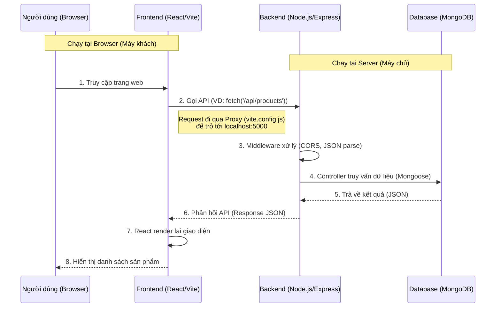

# TÀI LIỆU GIẢI THÍCH HỆ THỐNG (Dành cho trả lời Giảng viên)

Tài liệu này giải thích chi tiết toàn bộ cách vận hành của hệ thống Website bán iPhone, bao gồm sơ đồ luồng dữ liệu, giải thích chức năng từng file code và vận hành thực tế.

> **Lưu ý về Python**: Trong source code hiện tại của bạn **HOÀN TOÀN KHÔNG CÓ** file Python nào do bạn viết. Project này viết bằng **100% JavaScript** (Node.js cho Backend và React cho Frontend). Nếu giảng viên hỏi về Python, hãy trả lời tự tin là "Em sử dụng Node.js, không dùng Python".

---

## 1. Sơ đồ Vận Hành Hệ Thống (Architecture Diagram)

Đây là bức tranh tổng quan về cách hệ thống hoạt động:

---

## 2. Giải thích Luồng Vận Hành (Operation Flow)

### Bước 1: Khởi động (Startup)
*   **Backend**: Khi chạy `npm start` (tại `backend/`), file `server.js` được thực thi. Nó khởi tạo Express app, kết nối MongoDB, và lắng nghe ở cổng **5000**.
*   **Frontend**: Khi chạy `npm run dev` (tại `iphone-main/`), Vite khởi động server dev ở cổng **5173**.

### Bước 2: Người dùng truy cập
*   Người dùng mở `http://localhost:5173`.
*   Trình duyệt tải file `index.html` -> gọi `main.jsx` -> render `App.jsx`.

### Bước 3: Giao tiếp Client - Server (Network Programming)
*   Tại component `ProductList.jsx`, React chạy `useEffect`.
*   Code gọi `fetch('/api/products')`.
*   Nhờ cấu hình `proxy` trong `vite.config.js`, request này được chuyển tiếp ngầm đến `http://localhost:5000/api/products`.

### Bước 4: Xử lý tại Server
*   Request đến `server.js`.
*   Server tìm route tương ứng: `app.use("/api/products", productRoutes)`.
*   Nó vào file `routes/product.routes.js`, tìm thấy dòng `router.route('/').get(getProducts)`.
*   Nó gọi hàm `getProducts` trong `controllers/product.controller.js`.
*   Hàm này dùng Model `Product` để lệnh MongoDB tìm dữ liệu: `Product.find({...})`.

### Bước 5: Trả về và Hiển thị
*   MongoDB trả dữ liệu -> Controller nhận được -> Gửi về Client dưới dạng JSON (`res.json(...)`).
*   Frontend nhận JSON -> Cập nhật State (`setProducts`) -> Giao diện tự động vẽ ra danh sách sản phẩm.

---

## 3. Giải Thích Chi Tiết Từng File Code

### A. PHẦN BACKEND (`/backend`)

Đây là phần máy chủ, xử lý logic và dữ liệu.

| Tên File/Thư mục | Chức năng (Trả lời giảng viên) |
| :--- | :--- |
| **`server.js`** | **File chính (Main Entry)**. Khởi tạo server, kết nối Database, cấu hình CORS (để Client gọi được), và định nghĩa các đường dẫn (Routes) chính. |
| `config/db.js` | Chứa hàm `connectDB` để kết nối tới MongoDB. |
| `models/` | **Định nghĩa cấu trúc dữ liệu (Schema)**. Ví dụ `Product.js` quy định sản phẩm phải có tên, giá, ảnh... `User.js` quy định người dùng có email, pass. |
| `controllers/` | **Nơi xử lý logic chính**. Ví dụ `product.controller.js` chứa code: "Khi ai đó hỏi lấy SP, tôi sẽ vào DB lấy và trả về". `auth.controller.js` xử lý Đăng ký/Đăng nhập. |
| `routes/` | **Người chỉ đường**. Quy định URL nào thì gọi Controller nào. VD: "URL `/login` thì gọi hàm `login`". |
| `middleware/` | **Bộ lọc**. Chạy giữa các request. VD: `authMiddleware.js` kiểm tra xem user đã đăng nhập chưa mới cho đi tiếp. `error.js` xử lý lỗi chung. |
| `.env` | **File bảo mật**. Chứa mật khẩu DB, PORT, Secret Key. Không bao giờ đưa file này lên Git. |

### B. PHẦN FRONTEND (`/iphone-main`)

Đây là phần giao diện người dùng, viết bằng React.

| Tên File/Thư mục | Chức năng (Trả lời giảng viên) |
| :--- | :--- |
| **`package.json`** | Khai báo thư viện (React, Three.js, GSAP...). Quan trọng nhất là lệnh `npm run dev`. |
| **`vite.config.js`** | **File cấu hình Vite**. Quan trọng nhất là đoạn `server: { proxy: ... }` giúp kết nối Frontend với Backend mà không bị chặn (CORS). |
| `index.html` | File HTML duy nhất. Chứa thẻ `
` là nơi ứng dụng React "bám" vào. |
| `src/main.jsx` | Điểm bắt đầu của React. Nó lấy `App.jsx` và nhét vào `index.html`. |
| **`src/App.jsx`** | **Component Cha (Root Component)**. Chứa toàn bộ bố cục trang web: Navbar, Hero, Features, Footer... v.v. |
| `src/components/` | Chứa các thành phần nhỏ của giao diện. |
| `src/components/ProductList.jsx` | **(MỚI)** Component do chúng ta thêm vào. Chứa logic **Lập trình mạng**: dùng `fetch` để lấy data từ Server. |
| `src/utils/` | Chứa các tài nguyên ảnh, video, hàm hỗ trợ nhỏ. |

---

## 4. Các Câu Hỏi Giảng Viên Thường Hỏi

**Q1: Em kết nối Client và Server như thế nào?**
> **Trả lời:** Em sử dụng giao thức HTTP (RESTful API). Client dùng hàm `fetch()` gửi request tới Server. Trong môi trường Dev, em cấu hình **Proxy** trong Vite để chuyển tiếp request từ cổng 5173 sang 5000 của Server.

**Q2: Dữ liệu đi từ đâu ra đâu?**
> **Trả lời:** Dữ liệu nằm trong MongoDB -> Server (Node.js) truy vấn qua Mongoose -> Server trả về JSON -> Client (React) nhận JSON và hiển thị lên màn hình.

**Q3: Tại sao file `server.js` lại cần `cors`?**
> **Trả lời:** Vì trình duyệt có cơ chế bảo mật chặn request khác nguồn (Client 5173 gọi Server 5000 là khác nguồn). Em dùng thư viện `cors` để Server cho phép Client truy cập.

**Q4: Code Python nằm ở đâu?**
> **Trả lời:** Dạ bài này em viết hoàn toàn bằng **JavaScript (Fullstack JS)**. Backend dùng Node.js, Frontend dùng React. Không có Python ạ. (Có thể thầy nhìn nhầm sang môn khác hoặc project khác).
